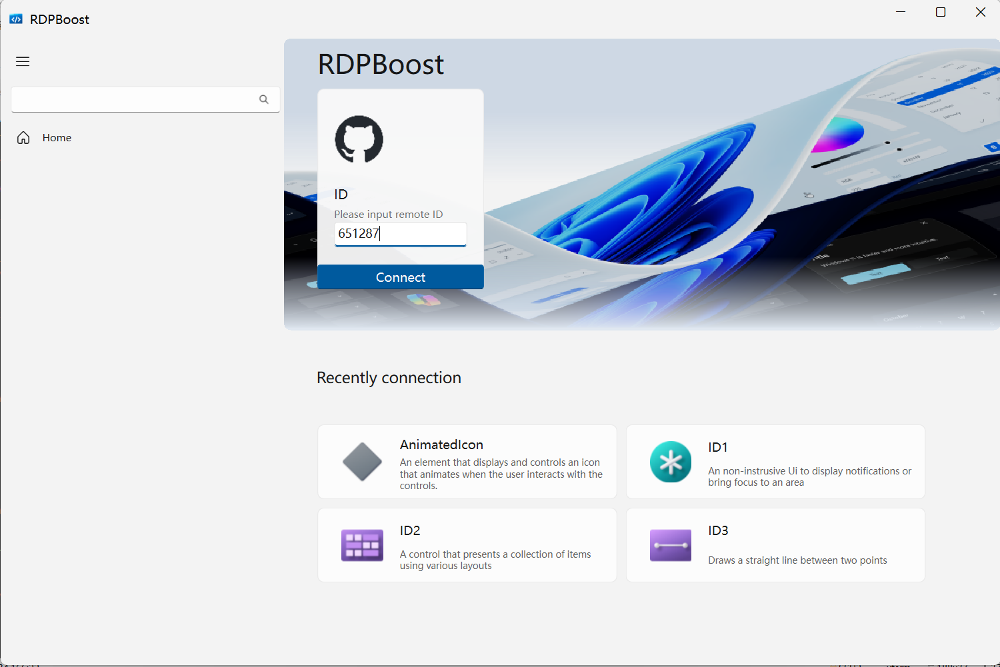
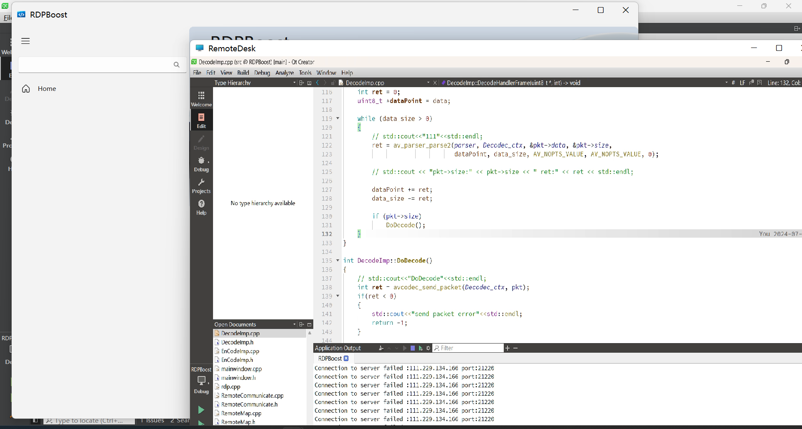

<h1 align="center">Welcome to RDPBoost 👋</h1>
<p>
  <a href="https://www.example.com/" target="_blank">
    
  </a>
  <a href="#" target="_blank">
    
  </a>
</p>

> Remote desktop based on C++, supporting intranet penetration through P2P and relay service communication
> TODO:P2P,end to end encryption,Mouse control

### ✨ [Demo](https://www.example.com/)
<div align=center>
  
</div>
<div align=center>
  
</div>
## Install

```sh
RDPBoost.exe
```

## Author

👤 **mingpuwu**

* Github: [@mingpuwu](https://github.com/mingpuwu)

## Show your support

Give a ⭐️ if this project helped you!

***
_This README was generated with ❤️ by [readme-md-generator](https://github.com/kefranabg/readme-md-generator)_